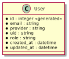

# Logical Data Model

```plantuml
@startuml
scale 0.65

' avoid problems with angled crows feet
skinparam linetype ortho

class User {
  * id : integer <<generated>>
  * email : string
  * provider : string
  * uid : string
  * roles : string[]
  * created_at : datetime
  * updated_at : datetime
}
@enduml
```

### Notes

* See the help docs for [Entity Relationship Diagram](https://plantuml.com/ie-diagram) and [Class Diagram](https://plantuml.com/class-diagram) for syntax help.
* We're using the `*` visibility modifier to denote fields that cannot be `null`.
